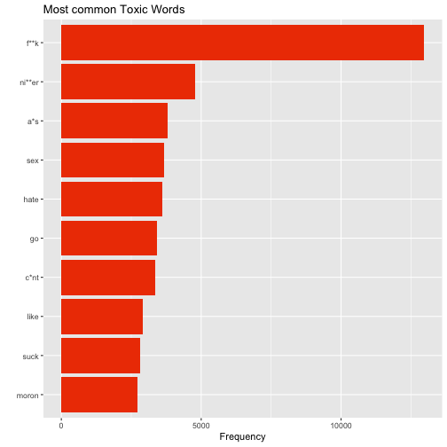

Natural Language Processing In R: A Wikipedia Case Study
========================================================
author: Jack Wilburn and Rob Squire
font-family: Georgia
date: 20th April 2018
autosize: true


Motivation
========================================================

* Text Analysis
* Develop Techniques
  - Data Aggregation/Cleaning
  - Modeling
  - Reporting

Objectives
========================================================

* Natural Language Processing (NLP)
  - Body Of Text
  - Useful Variables
  
* Predictive Modeling
  - Explantory Variables
  - 6 Response Variables
  - Inference
  
Methods 
========================================================

* Explore Raw Data

* Clean Data

* Create Variables

* Split data
  - Training/Test
  
Methods 
========================================================  

* Implement models 
  - Cross Validated Logistic Regression

* Assess Accuracy
  - Confusion Matrix

Libraries
========================================================


* readr
* stringi
* quanteda
* dplyr
* caret

***

* glmnet
* doParallel
* tidytext
* data.table
* sentimentr

Exploratory Data Analysis
========================================================


* Structure Of The Data

```
                id
1 003dbd1b9b354c1f
                                                                                                                                                                                                                                                              comment_text
1 You can do all you're doing right now but if you get a username you'll be able to do more and have more impact is what I'm saying. And you seem to be very familiar with everything so you probably have a username? Just get one, it takes 10 seconds.  (talk•contribs)
  toxic severe_toxic obscene threat insult identity_hate
1     0            0       0      0      0             0
```

Exploratory Data Analysis
========================================================


* Toxic: 9.5844483 %.

* Severe_toxic: 0.9995551 %.

* Obscene: 5.2948217 %.

* Threat: 0.2995532 %.

* Insult: 4.9363606 %.

* Identity Hate: 0.8804858 %.

Tidy Text Word Analysis
========================================================


Tidy Text Word Analysis
========================================================


Tidy Text Word Analysis
========================================================


Word frequencies for associated classifications.  


PCA
========================================================



It behaves as we'd expect.


Variables Created
========================================================

* Feature Count 
  - Punctuation
  - Capital letters
  - Smileys
  
* Sentiment analysis
  - Standard Lexicon/ library - AFINN
  - Custom lexicon
    -Swear
    -Hate
  
Variables Created
========================================================  
    
* Sparse Document Feature Matrix
  - Counts of every possible "feature"
    - Words, punt, multiple words
    - 4000 features.
   


Results
========================================================


* Toxic = 0.9337093. 
  - 31.1955249 % increase
  
* Severe_Toxic = 0.9902739
  - 2.6348808 % increase
  
* Obscene = 0.9610328
  - 27.1555764 % increase

Results
========================================================  

* Threat = 0.9970421
  - 0 % increase
  
* Insult = 0.9578492
  - 15.4600302 % increase
  
* Identity_Hate = 0.9913392
  - 0 % increase

Discussion
========================================================

* Satistically signficant Classifications:
  - Toxic
  - Obscene
  - Insult
  
* No Improvement:
  - Severe_toxic
  - Threat
  - Identity_hate
  
Discussion
========================================================
  
* Significant Variables:
  - Sentiment Analysis
  - Document Feature Matrix


Limitations
========================================================

* Data Size:

  - Prevalence (0.3% Threat)
  
  - Machine Learning Limited

* Computing power:
  
  - N-grams
  
  - Feature Combinations
  
  - Unkown Variables


Acknowledgements
========================================================

http://www.bannedwordlist.com/lists/swearWords.txt

https://www.cs.cmu.edu/~biglou/resources/bad-words.txt

https://github.com/t-davidson/hate-speech-and-offensive-language/tree/master/lexicons

https://www.tidytextmining.com/tidytext.html

https://www.kaggle.com/c/jigsaw-toxic-comment-classification-challenge


