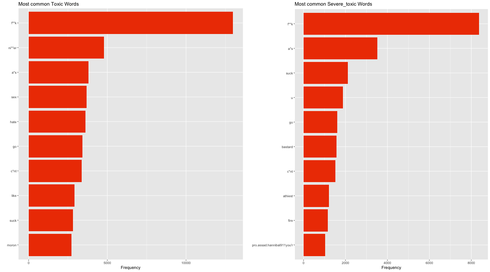
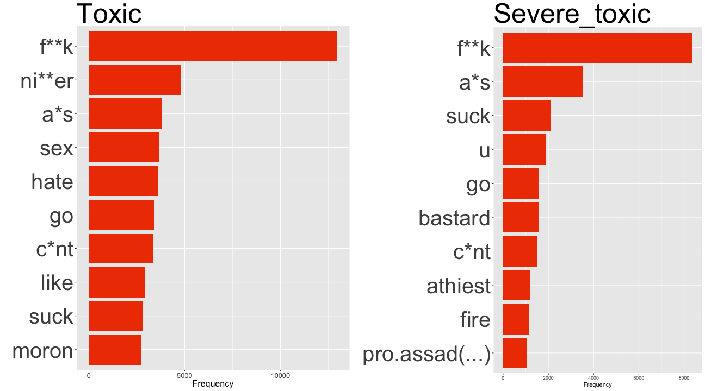
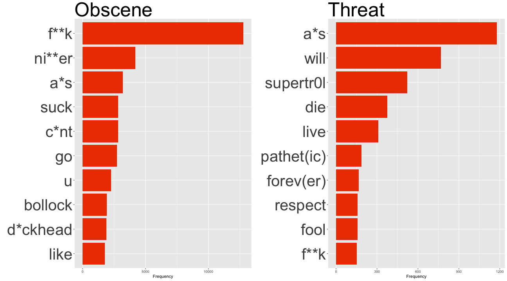
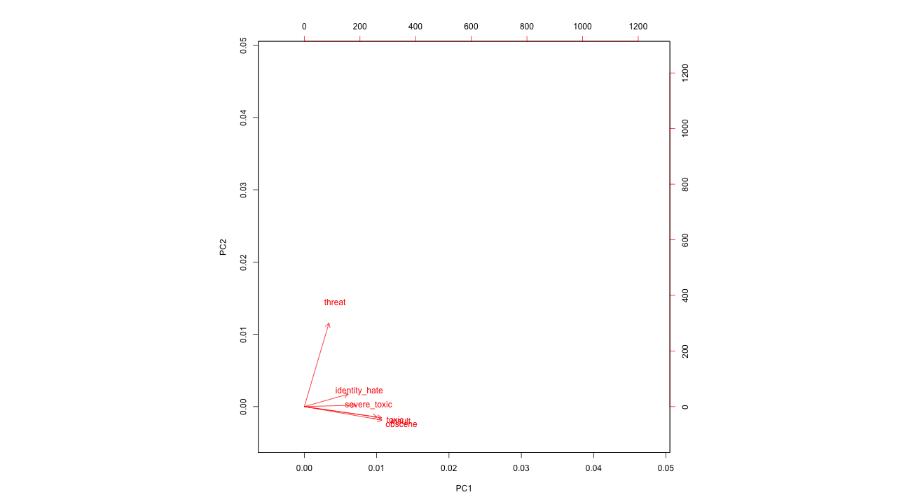

Natural Language Processing In R: A Wikipedia Case Study
========================================================
author: Jack Wilburn and Rob Squire
font-family: Georgia
date: 20th April 2018
autosize: true


Motivation
========================================================

* Text Analysis
* Develop Techniques
  - Data Aggregation/Cleaning
  - Modeling
  - Reporting

Objectives
========================================================

* Natural Language Processing (NLP)
  - Body Of Text
  - Useful Variables
* Predictive Modeling
  - Explantory Variables
  - 6 Response Variables
  - Inference
  
Methods 
========================================================

* Explore Raw Data

* Clean Data

* Create Variables

* Split data
  - Training/Test
  
Methods 
========================================================  

* Implement models 
  - Cross Validated Logistic Regression

* Assess Accuracy
  - Confusion Matrix

Libraries
========================================================


* readr
* stringi
* quanteda
* dplyr
* caret

***

* glmnet
* doParallel
* tidytext
* data.table
* sentimentr

Exploratory Data Analysis
========================================================


* Structure Of The Data

```
                id
1 003dbd1b9b354c1f
                                                                                                                                                                                                                                                              comment_text
1 You can do all you're doing right now but if you get a username you'll be able to do more and have more impact is what I'm saying. And you seem to be very familiar with everything so you probably have a username? Just get one, it takes 10 seconds.  (talk•contribs)
  toxic severe_toxic obscene threat insult identity_hate
1     0            0       0      0      0             0
```

Exploratory Data Analysis
========================================================


* Toxic: 9.5844483 %.

* Severe_toxic: 0.9995551 %.

* Obscene: 5.2948217 %.

* Threat: 0.2995532 %.

* Insult: 4.9363606 %.

* Identity Hate: 0.8804858 %.

Tidy Text Word Analysis
========================================================




Tidy Text Word Analysis
========================================================



Tidy Text Word Analysis
========================================================




These word frequency visuals gives us an idea of words associated with certain classifications.  We can add counts of these words into our variable creation to make better predictions.


PCA
========================================================



Variables Created
========================================================

*Feature Count 
  -punctuation
  -capital letters
  -smileys
  
*Sentiment analysis
  -Standard Lexicon/ library - AFINN
  - Custom lexicon
    -Swear
    -Hate
    
- Sparse Document Feature Matrix
  -counts of every possible "feature"
    -words, punt, multiple words
    -4000 features.
   


Results
========================================================

Toxic-NIR
Severe_Toxic
Obscene
Threat
Insult
Identity_Hate

Discussion
========================================================


Limitations
========================================================

Some categories did not have a large enough sample to predict off of.  The test data contained very zero Identity hate comments.  Threat comments only registered 0.3% of training data.  

Computing power presented a challenge to processing large document feature matrices.

We were able to create some variables that were intuitive and some that were less intuitive.  There exists the possibility that many more predictive variables exists but we were not able to come up with them.


Acknowledgements
========================================================

http://www.bannedwordlist.com/lists/swearWords.txt

https://www.cs.cmu.edu/~biglou/resources/bad-words.txt

https://github.com/t-davidson/hate-speech-and-offensive-language/tree/master/lexicons

https://www.tidytextmining.com/tidytext.html

https://www.kaggle.com/c/jigsaw-toxic-comment-classification-challenge


