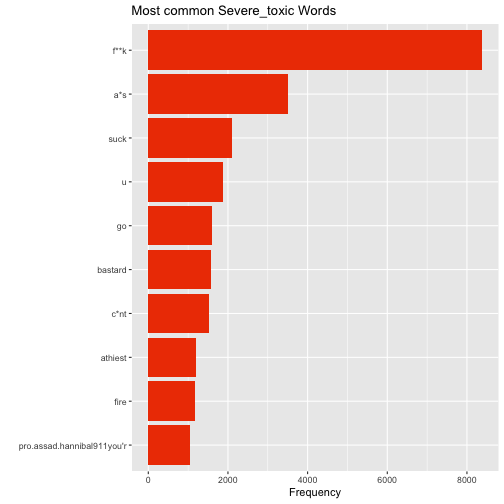
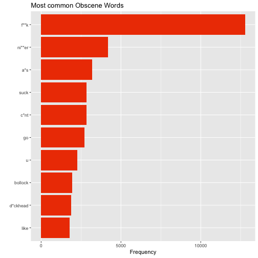
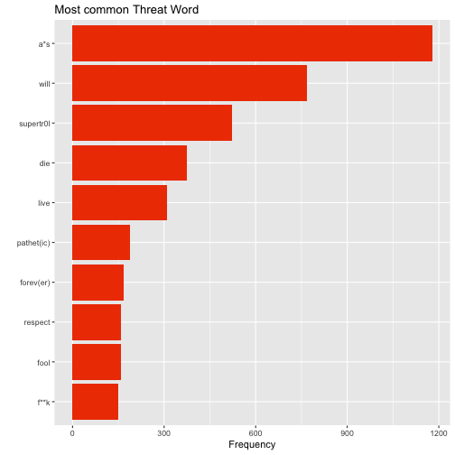
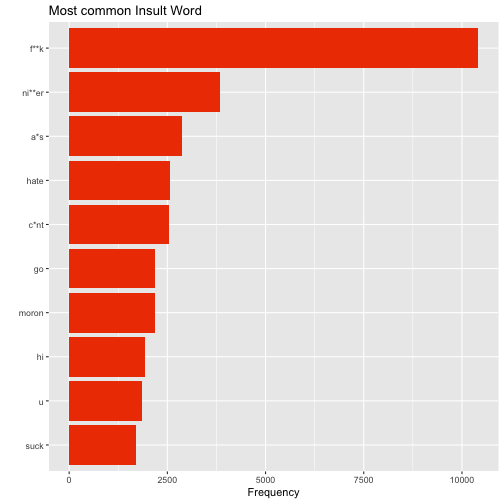
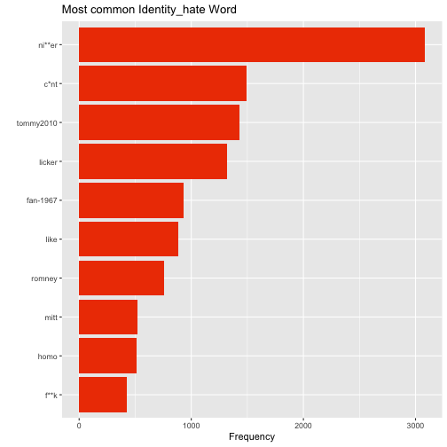

Natural Language Processing In R: A Wikipedia Case Study
========================================================
author: Jack Wilburn and Rob Squire
font-family: Georgia
date: 20th April 2018
autosize: true

Motivation
========================================================

* Kaggle
  - $50,000
* Skills
  - New
  - Old

Objectives
========================================================

* NLP
  - Body Of Text
  - Useful Variables
  - Example
* Predictive Modeling
  - Explantory Variables
  - Response Variable

Exploratory Data Analysis
========================================================


```
[1] "Explanation\nWhy the edits made under my username Hardcore Metallica Fan were reverted? They weren't vandalisms, just closure on some GAs after I voted at New York Dolls FAC. And please don't remove the template from the talk page since I'm retired now.89.205.38.27"
[2] "D'aww! He matches this background colour I'm seemingly stuck with. Thanks.  (talk) 21:51, January 11, 2016 (UTC)"                                                                                                                                                         
```

```
[1] "id"            "comment_text"  "toxic"         "severe_toxic" 
[5] "obscene"       "threat"        "insult"        "identity_hate"
```

Structure
========================================================


```
# A tibble: 1 x 8
  id     comment_text             toxic severe_toxic obscene threat insult
  <chr>  <chr>                    <int>        <int>   <int>  <int>  <int>
1 00009… "Explanation\nWhy the e…     0            0       0      0      0
# ... with 1 more variable: identity_hate <int>
```


Libraries
========================================================


```r
library(readr)
library(stringi)
library(quanteda)
library(dplyr)
library(caret)
library(glmnet)
library(doParallel)
registerDoParallel(4)
library(tidytext)
library(data.table)
library(sentimentr)
```


Data Exploration
========================================================
Now that we have some additional variables lets explore the data a bit.  
First lets count what we have.

```r
table(train$toxic)
```

```

     0      1 
144277  15294 
```

Data Exploration
========================================================


```r
table(train$obscene)
```

```

     0      1 
151122   8449 
```

Data Exploration
========================================================


```r
table(train$threat)
```

```

     0      1 
159093    478 
```

Data Exploration
========================================================


```r
table(train$insult)
```

```

     0      1 
151694   7877 
```

Data Exploration
========================================================


```r
table(train$identity_hate)
```

```

     0      1 
158166   1405 
```
The tally command tells us exactly how many of each category there are so we know what we are looking at.  Initial observations show that some categories like "threat" are quite small which may make classifying "threat" comments difficult. Let's take a look at the most common words from each category using tidy text.


Tidy Text Word Analysis
========================================================

```r
traincorpus = corpus(train$comment_text)
docvars(traincorpus, "id") = 1:nrow(train)
docvars(traincorpus, "toxic") = train$toxic
docvars(traincorpus, "severe_toxic") = train$severe_toxic
docvars(traincorpus, "obscene") = train$obscene
docvars(traincorpus, "threat") = train$threat
docvars(traincorpus, "insult") = train$insult
docvars(traincorpus, "identity_hate") = train$identity_hate
docvars(traincorpus, "ntokens") = ntoken(traincorpus, remove_punct = TRUE)
```

Tidy Text Word Analysis
========================================================


```r
traindfm2 = dfm(traincorpus, remove = stopwords("english"), stem = TRUE, remove_punct = TRUE)
toxicdfm2 = dfm_subset(traindfm2, toxic == 1, remove = stopwords("english"))
toxicfeatures2 = topfeatures(toxicdfm2, 10)
toxicwords2 = names(toxicfeatures2)

severe_toxicdfm2 = dfm_subset(traindfm2, severe_toxic == 1,remove = stopwords("english"))
severe_toxicfeatures2 = topfeatures(severe_toxicdfm2, 10)
severe_toxicwords2 = names(severe_toxicfeatures2)

obscenedfm2 = dfm_subset(traindfm2, obscene == 1,remove = stopwords("english"))
obscenefeatures2 = topfeatures(obscenedfm2, 10)
obscenewords2 = names(obscenefeatures2)

threatdfm2 = dfm_subset(traindfm2, threat == 1,remove = stopwords("english"))
threatfeatures2 = topfeatures(threatdfm2, 10)
threatwords2 = names(threatfeatures2)

insultdfm2 = dfm_subset(traindfm2, insult == 1,remove = stopwords("english"))
insultfeatures2 = topfeatures(insultdfm2, 10)
insultwords2 = names(insultfeatures2)

identity_hatedfm2 = dfm_subset(traindfm2, identity_hate == 1,remove = stopwords("english"))
identity_hatefeatures2 = topfeatures(identity_hatedfm2, 10)
identity_hatewords2 = names(identity_hatefeatures2)


data.frame(term = c("f**k","ni**er","a*s","sex","hate","go","c*nt","like","suck","moron"), freq = unname(toxicfeatures2)) %>%
    ggplot(aes(x = reorder(term, freq), y = freq)) + 
    geom_bar(stat = 'identity', fill = 'orangered2') + 
    labs(x = '', y = 'Frequency', title = 'Most common Toxic Words') + 
    coord_flip() 
```


```r
data.frame(term = c("f**k","a*s","suck","u","go","bastard","c*nt","athiest","fire","pro.assad.hannibal911you'r"), freq = unname(severe_toxicfeatures2)) %>%
    ggplot(aes(x = reorder(term, freq), y = freq)) + 
    geom_bar(stat = 'identity', fill = 'orangered2') + 
    labs(x = '', y = 'Frequency', title = 'Most common Severe_toxic Words ') + 
    coord_flip() 
```



```r
data.frame(term = c("f**k","ni**er","a*s","c*nt","suck","go","u","bollock","d*ckhead","like"), freq = unname(obscenefeatures2)) %>%
    ggplot(aes(x = reorder(term, freq), y = freq)) + 
    geom_bar(stat = 'identity', fill = 'orangered2') + 
    labs(x = '', y = 'Frequency', title = 'Most common Obscene Words') + 
    coord_flip() 
```



```r
data.frame(term = c("a*s","will","supertr0l","die","live","pathet(ic)","forev(er)","fool","respect","f**k"), freq = unname(threatfeatures2)) %>%
    ggplot(aes(x = reorder(term, freq), y = freq)) + 
    geom_bar(stat = 'identity', fill = 'orangered2') + 
    labs(x = '', y = 'Frequency', title = 'Most common Threat Word') + 
    coord_flip() 
```



```r
data.frame(term = c("f**k","ni**er","a*s","hate","c*nt","go","moron","hi","u","suck"), freq = unname(insultfeatures2)) %>%
    ggplot(aes(x = reorder(term, freq), y = freq)) + 
    geom_bar(stat = 'identity', fill = 'orangered2') + 
    labs(x = '', y = 'Frequency', title = 'Most common Insult Word') + 
    coord_flip() 
```



```r
data.frame(term = c("ni**er","c*nt","tommy2010","licker","fan-1967","like","romney","mitt","homo","f**k"), freq = unname(identity_hatefeatures2)) %>%
    ggplot(aes(x = reorder(term, freq), y = freq)) + 
    geom_bar(stat = 'identity', fill = 'orangered2') + 
    labs(x = '', y = 'Frequency', title = 'Most common Identity_hate Word') + 
    coord_flip() 
```


These word frequency visuals gives us an idea of words associated with certain classifications.  We can add counts of these words into our variable creation to make better predictions.

##PCA


```
Error in head(cars_pca_tidy_wide) : object 'cars_pca_tidy_wide' not found
```
